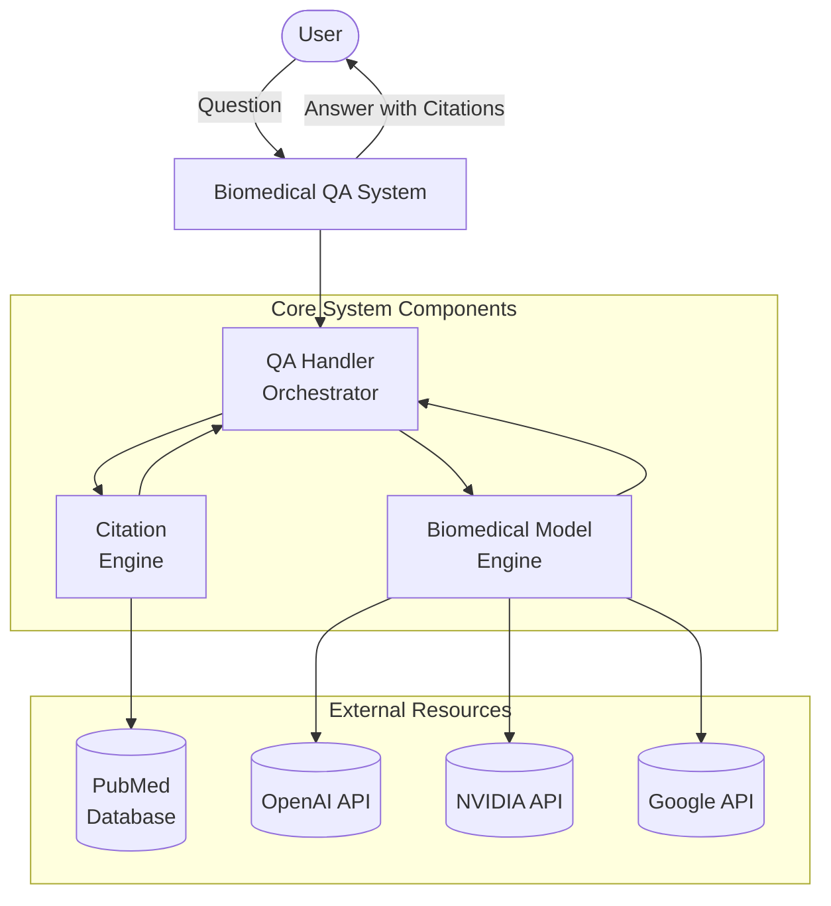
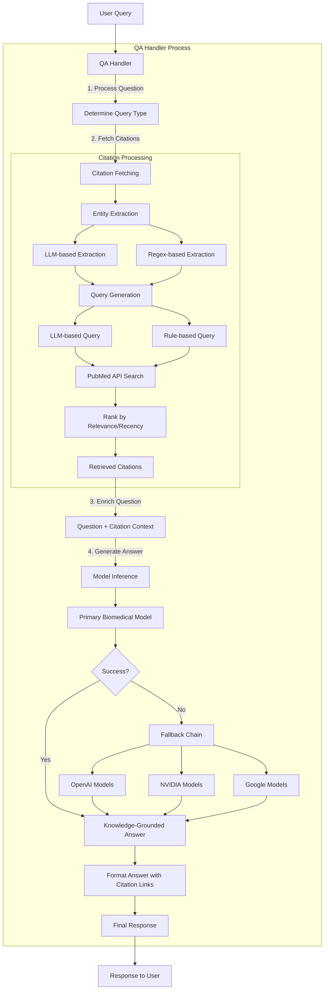
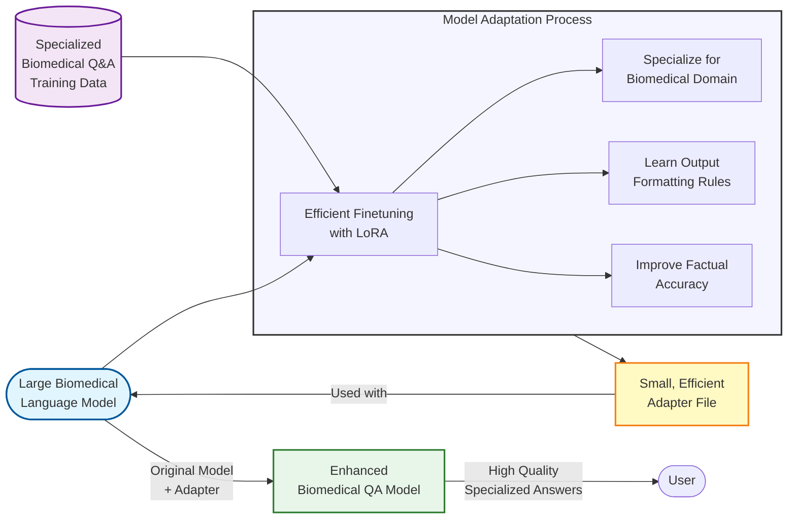
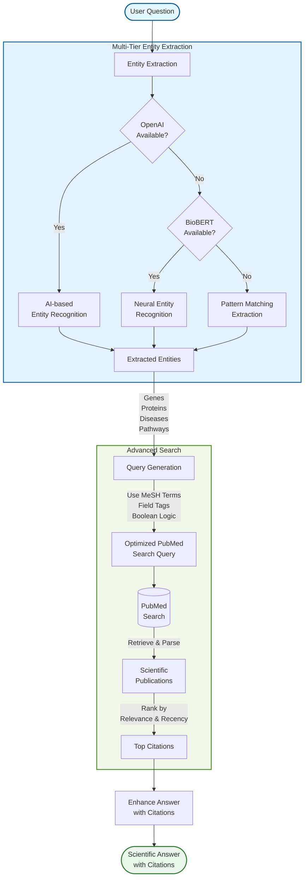

# Biomedical QA System Architecture

## High-Level System Overview



## System Architecture Diagram



## Citations as Context Workflow

```mermaid
flowchart LR
    Question([User Question]) --> Extract[Extract Entities]
    Extract --> Generate[Generate PubMed Query]
    Generate --> Fetch[Fetch PubMed Citations]
    Fetch --> Rank[Rank by Relevance]
    
    subgraph Citations_As_Context ["Using Citations as Context"]
        Rank --> |Top Citations| Enrich[Enrich Question with Context]
        Enrich --> |"Question + Scientific Context"| Model[Biomedical Model]
        Model --> |Knowledge-Grounded Answer| FormatResponse[Format Response]
        FormatResponse --> |Add Citation Links| FinalAnswer[Final Answer]
    end
    
    FinalAnswer --> User([User])
    
    style Citations_As_Context fill:#f9f9ff,stroke:#333,stroke-width:2px
    style Question fill:#e1f5fe,stroke:#01579b,stroke-width:2px
    style User fill:#e1f5fe,stroke:#01579b,stroke-width:2px
    style FinalAnswer fill:#e8f5e9,stroke:#2e7d32,stroke-width:2px
```



## Model Inference Flow Detail

```mermaid
flowchart TD
    Question[User Question] --> |determine_query_type| QueryType[Determine Query Type]
    
    QueryType --> |fetch citations| Citations[Retrieved Citations]
    
    subgraph BiomedicalModel ["BiomedicalModel Class (model.py)"]
        Question --> |design_prompt| PromptConstruct[Construct Prompt]
        Citations --> |provide context| PromptConstruct
        
        subgraph Prompt_Components ["Prompt Construction with Citation Context"]
            PromptConstruct --> SystemPrompt[INFERENCE_SYSTEM_PROMPT]
            PromptConstruct --> TypeInstructions[QUERY_TYPE_INSTRUCTIONS]
            PromptConstruct --> QuestionText[Original Question]
            PromptConstruct --> CitationContext[Citation Excerpts\nand Abstracts]
            PromptConstruct --> |for structured types| FewShot[FEW_SHOT_EXAMPLES]
            
            SystemPrompt --> FinalPrompt[Final Enriched Prompt]
            TypeInstructions --> FinalPrompt
            QuestionText --> FinalPrompt
            CitationContext --> FinalPrompt
            FewShot --> FinalPrompt
        end
        
        FinalPrompt --> Tokenize[tokenizer\ntokenize input to tensors]
        Tokenize --> |inputs.to(device)| DeviceMove[Move to device]
        DeviceMove --> ActiveModel{self.peft_model\navailable?}
        ActiveModel -->|Yes| UsePEFT[Use PEFT model]
        ActiveModel -->|No| UseBase[Use base model]
        
        UsePEFT --> |model.generate| Generation[Generate text]
        UseBase --> |model.generate| Generation
        Generation --> Decode[tokenizer.decode]
        Decode --> FormatAnswer[format_scientific_answer]
        FormatAnswer --> ValidateAnswer{Valid\nStructured\nAnswer?}
        ValidateAnswer -->|Yes| ReturnAnswer[Return knowledge-grounded answer]
        ValidateAnswer -->|No| ReturnError[Return error message]
    end
    
    subgraph QAHandler ["QA Handler Fallback Chain"]
        ReturnError --> FallbackChain[Fallback Chain]
        FallbackChain --> |For OpenAI models| OpenAI[_call_openai_fallback\nwith citation context]
        FallbackChain --> |For NVIDIA models| NVIDIA[_call_nvidia_fallback\nwith citation context] 
        FallbackChain --> |For Gemini models| Google[_call_gemini_fallback\nwith citation context]
        OpenAI --> |Loop until success\nor all models tried| CheckFallback{Fallback\nSucceeded?}
        NVIDIA --> CheckFallback
        Google --> CheckFallback
        CheckFallback -->|Yes| FinalAnswer[Return first successful answer]
        CheckFallback -->|No| FailedAnswer[Return error message]
    end
```

## Citation Extraction Flow Detail

```mermaid
flowchart TD
    Question[User Question] --> |fetch_pubmed_citations| FetchMain[Main Citation Function]
    
    subgraph Entity_Extraction ["Entity Extraction Phase"]
        FetchMain --> CheckLLMExtraction{use_llm_extraction\nenabled?}
        CheckLLMExtraction -->|Yes| LLMCheck{OpenAI client\navailable?}
        CheckLLMExtraction -->|No| RegexExtract[extract_entities_from_text]
        
        LLMCheck -->|Yes| LLMExtract[extract_entities_with_llm]
        LLMCheck -->|No| RegexExtract
        
        LLMExtract --> ExtractedEntities[Extracted Entities Dictionary]
        RegexExtract --> ExtractedEntities
    end
    
    ExtractedEntities --> |optimize_query| QueryOptimization[Query Optimization]
    
    subgraph Query_Generation ["Query Generation Phase"]
        QueryOptimization --> CheckLLMQuery{use_llm_query_generation\nenabled?}
        CheckLLMQuery -->|Yes| TryLLMQuery[generate_improved_query_with_llm]
        CheckLLMQuery -->|No| FallbackToRules[Rule-based query generation]
        
        TryLLMQuery --> QuerySuccess{Success?}
        QuerySuccess -->|Yes| LLMGeneratedQuery[LLM Generated Query]
        QuerySuccess -->|No| FallbackToRules
        
        FallbackToRules --> RuleBasedQuery[Rule-based Query]
        
        LLMGeneratedQuery --> OptimizedQuery[Optimized Query]
        RuleBasedQuery --> OptimizedQuery
    end
    
    OptimizedQuery --> AddFilters[Apply Filters]
    
    subgraph Filters ["Filter Application"]
        AddFilters --> |if enabled| ReviewFilter["Review[Publication Type]"]
        AddFilters --> |if max_age_years > 0| DateFilter["Date Range Filter"]
        ReviewFilter --> CombineFilters[Combine Query and Filters]
        DateFilter --> CombineFilters
        CombineFilters --> FinalQuery[Final PubMed Query]
    end
    
    FinalQuery --> SearchPubMed[PubMed API Search]
    
    subgraph PubMed_Search ["PubMed API Interaction"]
        SearchPubMed --> |json_fallback_search| JSONSearch[JSON esearch + XML efetch]
        JSONSearch --> CheckResults{Citations\nfound?}
        
        CheckResults -->|Yes| ParseJSON[Parse PubMed XML]
        CheckResults -->|No| XMLFallback[XML esearch + XML efetch]
        
        XMLFallback --> XMLCheck{Results\nfound?}
        XMLCheck -->|Yes| ParseXML[Parse PubMed XML]
        XMLCheck -->|No| EmptyResults[Empty Citation List]
        
        ParseJSON --> CitationObjects[Citation Objects]
        ParseXML --> CitationObjects
        EmptyResults --> CitationObjects
    end
    
    CitationObjects --> |if citations exist| RankCitations[Rank Citations]
    CitationObjects --> |if no citations| NoResults[Return Empty List]
    
    subgraph Citation_Processing ["Citation Processing"]
        RankCitations --> ScoreCitations[Calculate Relevance Scores]
        ScoreCitations --> SortCitations[Sort by Score (Descending)]
        SortCitations --> LimitResults[Limit to max_citations]
        LimitResults --> ExtractGenes[Extract Genes from Titles]
        ExtractGenes --> ReturnCitations[Return Citation List]
    end
    
    NoResults --> ReturnCitations
    ReturnCitations --> |Used as Context| ModelInput[Input to Biomedical Model]
```

## Simplified Model Finetuning (For Non-Technical Audiences)



## Enhanced Entity Extraction for Citations



# Understanding Model Finetuning in the Biomedical QA System

## Why Finetune the Model?

Finetuning the base biomedical model has several critical advantages:

1. **Domain Specialization**: Even though models like BioBERT-v1.1 FOR SQUAD are already trained on biomedical data, they may not be specialized for the exact type of questions our system needs to answer. Finetuning allows adaptation to your specific biomedical sub-domain (e.g., genetics, proteomics, pathways).

2. **Output Format Control**: The system needs to produce structured, consistent answers (e.g., bulleted lists of genes). Finetuning teaches the model to follow these output patterns consistently.

3. **Enhanced Accuracy**: Finetuning on curated biomedical Q&A pairs improves accuracy for specific types of questions, reducing hallucinations and increasing factual correctness.

4. **Response Style Alignment**: The model learns to follow the system's scientific writing style without unnecessary explanations or qualifiers.

5. **Efficiency**: While fallback models like GPT-4oq might provide high-quality answers, a finetuned domain-specific model can achieve similar performance at lower cost and latency.

## When to Finetune vs. When to Use Fallbacks

### When to Finetune

1. **When you have domain-specific training data**: If you have high-quality biomedical Q&A pairs or can create them, finetuning allows the model to learn from this dataset.

2. **For high-volume, similar queries**: If your system will handle many questions of similar types (e.g., "What genes are involved in X disease?"), finetuning will produce more consistent outputs.

3. **For performance optimization**: When low latency is critical, a smaller finetuned model often outperforms sending queries to external API models.

4. **For data privacy**: If queries contain sensitive information, using a locally finetuned model avoids sending data to external APIs.

### When to Use Fallbacks

1. **For rare or novel query types**: When the primary model encounters question types it wasn't finetuned for.

2. **When the primary model fails**: If the base model returns errors or low-confidence responses, fallbacks provide resilience.

3. **During early development**: While collecting training data to finetune your primary model, fallbacks ensure the system remains functional.

4. **For complex reasoning**: Some questions require advanced reasoning capabilities that might be better handled by larger models like GPT-4o.

5. **To handle edge cases**: Unusual or highly complex biomedical questions that fall outside the primary model's expertise.

## How Our Finetuning Implementation Works

### LoRA (Low-Rank Adaptation)

This system uses LoRA for Parameter-Efficient Fine-Tuning (PEFT), which has several advantages:

- **Memory Efficiency**: Updates only a small subset of model parameters
- **Storage Efficiency**: Adapter weights are much smaller than full model weights
- **Faster Training**: Requires significantly less compute than full model finetuning
- **Base Model Preservation**: Keeps base model weights intact, allowing for multiple specialized adapters

### Configuration Parameters in config.json

The `training` section in `config.json` controls the finetuning process:

```json
"training": {
    "peft_method": "lora",        // PEFT method to use (currently supporting LoRA)
    "lora_r": 8,                  // Rank of the LoRA update matrices (lower = smaller, less expressive)
    "lora_alpha": 16,             // Scaling factor for LoRA updates (higher = stronger updates)
    "lora_dropout": 0.05,         // Dropout probability for LoRA layers
    "batch_size": 2,              // Training batch size
    "learning_rate": 5e-5,        // Learning rate for optimizer
    "num_epochs": 3,              // Number of training epochs
    "evaluation_strategy": "steps", // When to evaluate during training
    "eval_steps": 100,            // How often to evaluate
    "save_steps": 100,            // How often to save checkpoints
    "gradient_accumulation_steps": 4, // Accumulate gradients over multiple steps
    "layer_freezing": false,      // Whether to freeze some layers
    "num_unfrozen_layers": 0,     // Number of layers to leave unfrozen
    "seed": 42                    // Random seed for reproducibility
}
```

### Target Modules Selection

Our code automatically determines appropriate target modules based on the model architecture:

- For BioGPT-like models: Query and value projection matrices
- For LLaMA-like models: Query, key, value, output, gate, up, and down projections
- For other architectures: Automatic detection with fallback to common patterns

### Finetuning Data Requirements

For effective finetuning, you should prepare:

1. **Training Dataset**: Pairs of biomedical questions and their structured answers
2. **Evaluation Dataset**: Held-out examples to evaluate during training
3. **Data Format**: Question-answer pairs formatted according to the system's prompt structure

### Adapter Loading at Runtime

Once finetuned, the LoRA adapter is automatically loaded at runtime:

```python
def load_peft_adapter(self, adapter_path: Optional[str] = None) -> bool:
    """Load a trained PEFT adapter if available"""
    if adapter_path is None:
        adapter_path = os.path.join(self.config.get("output", {}).get("dir", "output"), "peft_adapter")
    
    if os.path.exists(adapter_path):
        self.peft_model = PeftModel.from_pretrained(self.model, adapter_path, is_trainable=False)
        return True
    else:
        return False
```

## Advanced Finetuning Strategies

### Hyperparameter Optimization

The key hyperparameters to tune for LoRA are:

- **lora_r**: Controls expressivity of adapters (higher = more expressive but larger)
- **lora_alpha**: Controls strength of LoRA updates (typically 2× lora_r)
- **learning_rate**: Critical for convergence (typically 1e-4 to 1e-5)
- **batch_size**: Affects training stability (use gradient accumulation for small GPUs)

### Progressive Finetuning

For complex adaptation, consider:

1. First finetune on a larger biomedical corpus for domain adaptation
2. Then finetune on specific task data for output format and style

### Target Module Selection Strategies

The choice of which modules to apply LoRA to significantly impacts results:

- **Attention-only**: Efficient but less expressive (query, key, value projections)
- **Attention + MLP**: Better results but more parameters (adds gate, up, down projections)
- **Comprehensive**: Apply to all linear layers (most parameters, best results)

### Quantization-Aware Finetuning

Our system supports 4-bit quantization for efficient training and inference:

```python
quant_config = BitsAndBytesConfig(
    load_in_4bit=True,
    bnb_4bit_compute_dtype=torch.float16,
    bnb_4bit_quant_type="nf4",
    bnb_4bit_use_double_quant=True
)
```
